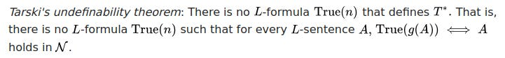
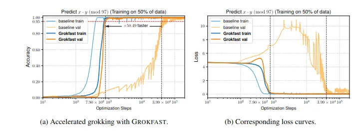
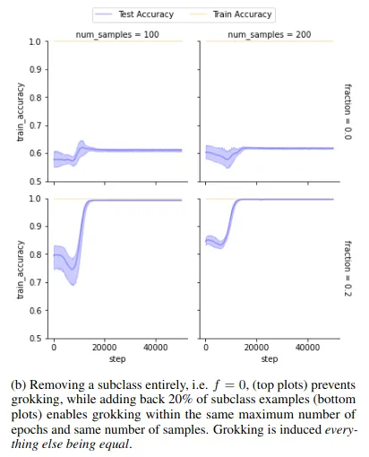
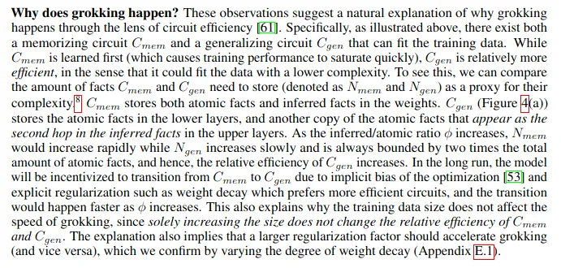
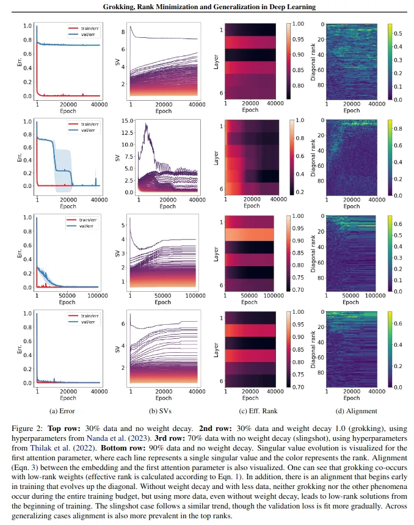
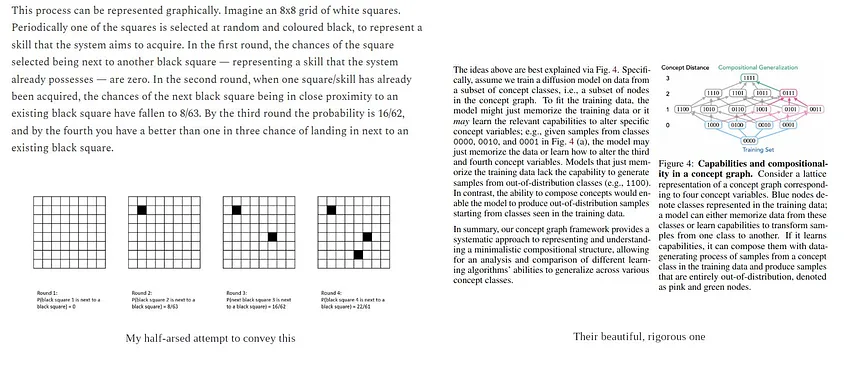
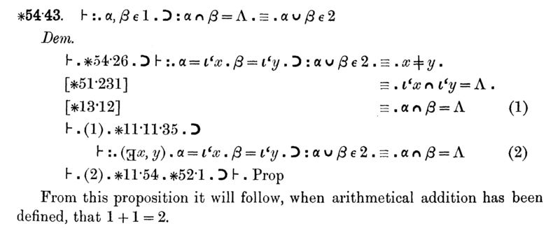
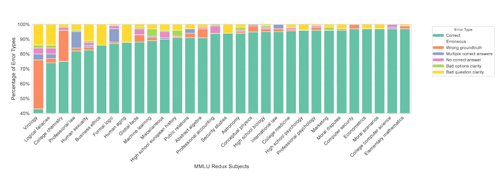
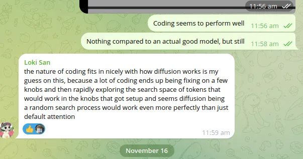

In this short article, we present a summary of current work on the grokking phenomenon that emerges when AI models are significantly over-trained. We suggest that this provides evidence of the model’s attempts to define truth inductively through the creation of consensus sets within the base training set and encode it via patterns overlaid upon the same parameters used to memorize this set.
<!--truncate-->

## Can an AI Tell the Truth?

In order to improve, it is necessary to know whether what you’re doing now is right or wrong. For AI models this is extremely difficult. LLMs are known to struggle when it comes to distinguishing fact and hallucination. A part of this can be attributed to the way in which parametric memory (i.e. the compression of data into vectors) works, and a part to the compulsion to be helpful and engaging instilled through reinforcement learning. Mostly, however it is a reflection of a fundamental property of mathematics: that you can’t effectively check the truth of a statement in a given order formal language if the only tools at your disposal are those provided by that language. Or, alternatively:

### 

> In other words, there is no way to prove that 1+1=2 using basic arithmetic alone[^1].

Operating as it does at a single layer of abstraction, an AI model is incapable of saying that 1+1=328 is definitely wrong; it can only say that it is improbable. To deal with this issue, the principal solution has been to increase the size of models and the amount of training data used, as well as employing standardized benchmarks (model IQ tests) to assess performance.

The problem with this approach is that if both the training materials and the test are human-produced, the AI is unlikely to ever get much more intelligent than the most intelligent human in any given field[^2]. Until we build an AI that can discover and integrate its own knowledge, artificial super-intelligence will remain out of reach.

But if the only way to learn new things is from smarter humans, then how did the smartest human do it?

## The Work-Arounds

Fortunately, there are two ways around this problem. The first is **reality testing**. I couldn’t employ first-order arithmetic to prove that 1+1=2, but I just have to hold up two fingers to know it to be true. Not having contact with the physical world, it is harder for LLMs to do this, but not impossible—give an AI an enumerable, extensible, and objective metric that is outside its control (such as the amount of storage space taken up by its own backups or the amount of money in a crypto wallet) and the coding tools to interact with the world in such a way as to affect this metric, and it will begin reality-testing hypotheses immediately. If the status of successful and failed attempts is then stored for future fine-tuning, the model becomes capable of self-improvement (as we have demonstrated [elsewhere](https://xianyangcb.substack.com/p/a-system-for-evolving-general-artificial-intelligence-from-existing-technologies-b4f5c4d1335a)).

Under this approach, no smarter human is required: the model comes up with its own ideas, tests them, and learns which work and which don’t from its own testing. After all, when Newton developed his theory of gravitation, he checked it against observed planetary movements, not against the opinions of someone more intelligent.

But he did something else as well, which brings us to the **second work-around**: he created a higher-order metalanguage for the purpose of establishing a [T-schema](https://en.wikipedia.org/wiki/T-schema)—that is, an inductive abstraction of truth against which lower-order propositions may be tested. Based on empirical data concerning planetary movements (or at least Kepler’s data), he derived a set of formulae that succinctly explained all of these movements. From that point on, if the formula says that Mercury should be 36 million miles from the sun, while your latest observation suggests that it is only 24 miles away, then the likelihood is that your observation is wrong—after all, the formula can cite every single previous observation to back it up.

## Truth Through Consensus

In this article we suggest that recent evidence from several papers suggests that this is what AI models are attempting to do via the **grokking** process.

**Grokking** refers to a phenomenon where AI models’ test responses improve with more training, grow worse as they pass the point of over-training (i.e., when they become too focused on memorizing the training set and lose the ability to generalize), and then suddenly improve to an astonishing degree.

### 

As seen in the third image, the model’s answers during training improve as it memorizes the training questions with greater fidelity, leading to a continuous decrease in training loss. However, test performance initially improves, then declines as the model overfits to the training set. Finally, as the model groks, **test loss drops to near zero**, indicating successful generalization. These grokked models can be remarkably powerful— [one team](https://arxiv.org/pdf/2405.150712) even managed to outperform GPT-4 Turbo and Gemini 1.5 using a grokked GPT[^3].

Recently, the [Grokfast team](https://arxiv.org/pdf/2405.20233) discovered that **memorization and generalization are driven by two distinct learning processes**, a fast and a slow one. Using Fourier transformations, they determined that adjustments to model weights during training can be decomposed into **high-frequency signals** (associated with memorization) and **low-frequency signals** (associated with generalization). By amplifying the low-frequency signals, they vastly accelerated generalization.

### 

At roughly the same time, a [research team in Brazil](https://arxiv.org/abs/2409.08282) explored what happens when an AI groks. They suspected that the model was **identifying relationships between different clusters of training data**, so they curated a dataset with known clusters. Removing a cluster drastically reduced generalization, while adding just a few examples from that cluster restored it.

### 

These findings suggest that when an AI **groks**, it carefully adjusts its weights to encode information about relationships between groups of data while preserving its ability to recall the original training set. This delicate adjustment process explains why grokking takes so long.

To enable this, it is obliged to develop an internal metalanguage that will allow it to conduct internal evaluations of the “truthiness” of any given input statement based upon its abstraction of similar statements received previously. If every flower in the cat’s eyes is blue or purple, then an input suggesting that it should place a yellow one there will be flagged up as likely incorrect and checked. The result is that the model, when asked a question, does not simply spit out an average of the closest bits of rote learning it knows, it compares the likely answer against its own abstraction of answers within that category, coming up with a much better output. Or, as [Wang et al.](https://arxiv.org/pdf/2405.15071) put it:

### 

This would explain both the **slow weight change** during the grokking process and the **sudden leap in performance** once it generalizes. Further evidence from [Yunis et al](https://openreview.net/pdf?id=6NHnsjsYXH) suggests that grokking is associated with the model discovering a **low-rank encoding solution** (i.e., one that multiplies smaller-than-normal matrices):

### 
This, in turn, implies that the model is suddenly achieving higher performance as a consequence of encoding fewer features. The only possible explanation for this is that it has developed its own abstraction layer in which to talk to itself about higher order truths.

## Building Upon These Results

Grokking has the additional advantage of requiring relatively little data to attempt. Now that our [Generalising Agents](https://xianyangcb.substack.com/p/artificial-intelligences-in-the-guanzi) are up and producing data, our intention is to use this information - which fulfills the high quality/structured data requirements for grokking - to attempt to train a series of models. Transformers - even when grokked - are [known to struggle](https://arxiv.org/pdf/2405.15071) with composition tasks (i.e. ones relating to facts stored in different parts of the model), likely on account of their structure. Consequently, we plan to use diffusion models. These, despite the higher training cost, display [grokking-like behaviour](https://proceedings.neurips.cc/paper_files/paper/2023/file/9d0f188c7947eacb0c07f709576824f6-Paper-Conference.pdf) throughout the normal training process, not simply under specific conditions. Moreover, they over-perform on [compsitional tasks](https://proceedings.neurips.cc/paper_files/paper/2023/file/9d0f188c7947eacb0c07f709576824f6-Paper-Conference.pdf) as well as on [coding tasks more generally](https://arxiv.org/pdf/2410.17891) [^4], most likely due to their multiplicative approach to learning, as described [here](https://proceedings.neurips.cc/paper_files/paper/2023/file/9d0f188c7947eacb0c07f709576824f6-Paper-Conference.pdf). This is interesting from our perspective, given that we predicted something similar and made it a foundational component of our [Generalising Agent](https://xianyangcb.substack.com/p/a-system-for-evolving-general-artificial-intelligence-from-existing-technologies-b4f5c4d1335a) schema in 2020.

### 

This approach, in theory, could produce models capable of **discovering new real-world knowledge** and **generalizing relationships between data points**. We believe this is the path to **true independent knowledge generation**, and eventually, to **super-intelligence**.

---

[^1]: Even with extended formal logic, proving fundamental arithmetic truths is complex—Bertrand Russell and Alfred North Whitehead required hundreds of pages to establish basic mathematical principles. 

[^2]: Or, in some cases, only a mediocre human—many benchmark datasets contain serious errors, including over 50% of virology problems in MMLU. 

[^3]: Grokking has not been systematically applied to large models due to cost and risk, though Mark Zuckerberg hinted that Meta may have experimented with it internally.

[^4]: Diffusion models' superior performance in composition tasks suggests a connection between their structure and grokking behavior. 
