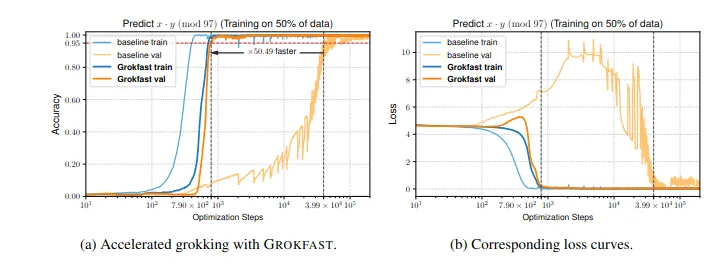
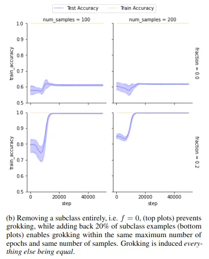

LLMs are known to struggle when it comes to distinguishing fact from hallucination. A part of this can be attributed to the way in which parametric memory (i.e. the compression of data into vectors) works, and a part to the compulsion to be helpful and engaging instilled through reinforcement learning. Mostly, however, it is a reflection of a fundamental property of mathematics: that you can’t effectively check the truth of a statement in a given order formal language if the only tools at your disposal are those provided by that language.

To deal with this issue, the principal solution has been to increase the size of the models and the amount of training data used, as well as employing standardized benchmarks (model IQ tests) to assess performance. The problem with this is that if both the training materials and the test are human-produced, the AI is unlikely to ever get much more intelligent than the most intelligent human in any given field[2]. Until we build an AI that can discover and integrate its own knowledge, artificial super-intelligence will remain out of reach.

The first approach is to allow the model to develop new ideas and reality-test them itself, as described above. The second, however, is to push the model to develop a higher-order metalanguage for the purpose of establishing a T-schema—that is, an inductive abstraction of truth against which lower-order propositions may be tested. Recent evidence suggests that this is what AI models are attempting to do via the grokking process.

Recently, the Grokfast team discovered that memorization and generalization are the product of two separate learning processes—a fast and a slow one. Using some nifty Fourier transformations, they worked out that the adjustments to model weights that happen during training can be decomposed into two frequencies:
- A high frequency signal associated with memorization.
- A low frequency signal associated with generalization.

The team tested this by amplifying the low frequency signals. The result was vastly accelerated generalization.

At roughly the same time, another team in Brazil was trying to work out what exactly the AI is doing when it groks. They suspected that it was trying to work out the relationships between the different clusters of training data it had been given, so they put together a highly curated dataset containing known clusters. Removing a cluster vastly reduced the model’s ability to generalize, while adding just a few examples from that cluster restored it.

These results combine to suggest an explanation for what the AI is doing when it groks: specifically, it is trying to adjust its weights with great care and delicacy so as to create patterns that will enable it to encode information regarding the relationships between the groups of data it has been fed, without losing the ability to respond to the original training set. The result is that the model, when asked a question, does not simply spit out an average of the closest bits of rote learning it knows; it compares the likely answer against its own abstraction of answers within that category, coming up with a much better output.

This would explain not just the comparatively slow weight change during the grokking process, but also the (otherwise inexplicable) sudden improvement far beyond anything displayed before.

Grokking has the additional advantage of requiring relatively little data to attempt. Now that our Superior Agents are live and producing data, our intention is to use this information—which fulfills the high quality/structured data requirements for grokking—to attempt to train a series of models. Transformers—even when grokked—are known to struggle with composition tasks (i.e. ones relating to facts stored in different parts of the model), likely on account of their structure. Consequently, we plan to use diffusion models. These, despite the higher training cost, display grokking-like behavior throughout the normal training process, not simply under specific conditions. Moreover, they over-perform on compositional tasks as well as on coding tasks more generally.

This, we feel, is the route to truly independent knowledge generation, and eventually to super-intelligence.
