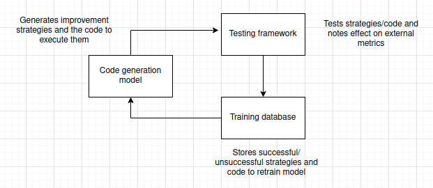
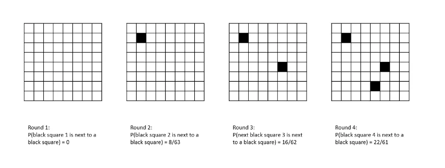

Our technical approach is to push for an AI to develop increasingly generalist (self-improving) abilities through evolution from three basic components.

**Firstly**, a fine-tuneable code generation model (currently Qwen 2.5 7b Instruct) receives the initial instruction to develop strategies for achieving a goal and then writes code to execute those strategies.

**Secondly**, a testing module notes the current status of evaluation metrics, attempts to run the generated code, and then re-checks the status of the metrics.

**Lastly**, the strategies, code, and their effects on the metrics are stored in a training database to further fine-tune the code generation model and improve its chances of successfully solving future problems.

These three components combine into a self-improvement module — which we have tested extensively since 2019 — and are essentially what make our Superior Agents, superior.

In this way, every problem solved becomes a means of solving future problems faster. Every solution stored in the training database increases the chance that future problems will be sufficiently similar to known problems as to be easily soluble by the code generation model.

While it will take the AI a great deal of time and effort to achieve its first milestone — and thereby its first skill — the second milestone will be easier to achieve as a result of the information gained in acquiring the first, and so on.

---

This process can be represented graphically. Imagine an 8x8 grid of white squares, each representing a skill. Periodically, a new square is selected at random and an attempt is made to color it black. If it is surrounded by white squares, there is a 10% chance that the attempt will succeed.

For each neighboring black square, the chances of a successful attempt rise by 10%, representing the greater ease in acquiring a new skill when it is similar to others already mastered. In the first round, the chances of the square selected being next to another black square — representing a skill that the system already possesses — are zero. In the second round, when one square/skill has already been acquired, the chances of the next black square being in close proximity to an existing black square fall to 8/63. By the third round, the probability is 16/62, and by the fourth you have a better than one in three chance of landing next to an existing black square.

By the end of the game, you are almost certain to succeed in coloring any new square upon which you land, all being surrounded by other black squares.

During any given iteration of the process the program will only learn a single skill, but the system as a whole is structured such that the acquisition of each new skill facilitates the acquisition of future skills — the “intelligence explosion” described in the introduction.
