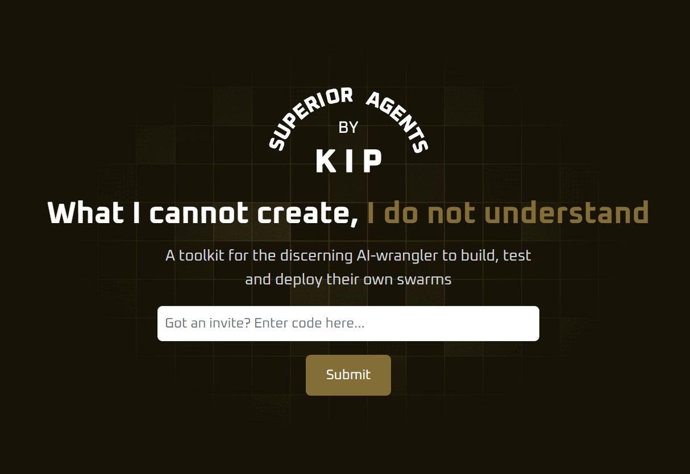
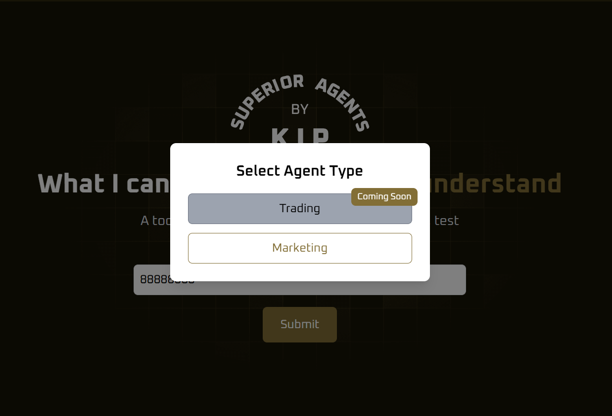

# Creating Your Agent via the GUI

Currently, a limited number of agents are available for test use. To get an access code, you will need to join our Discord and make a request.

The first choice you will need to make is whether you want to create a trading account or a social media marketing app.

Once that is done, you will be asked to set the core parameters of your app.