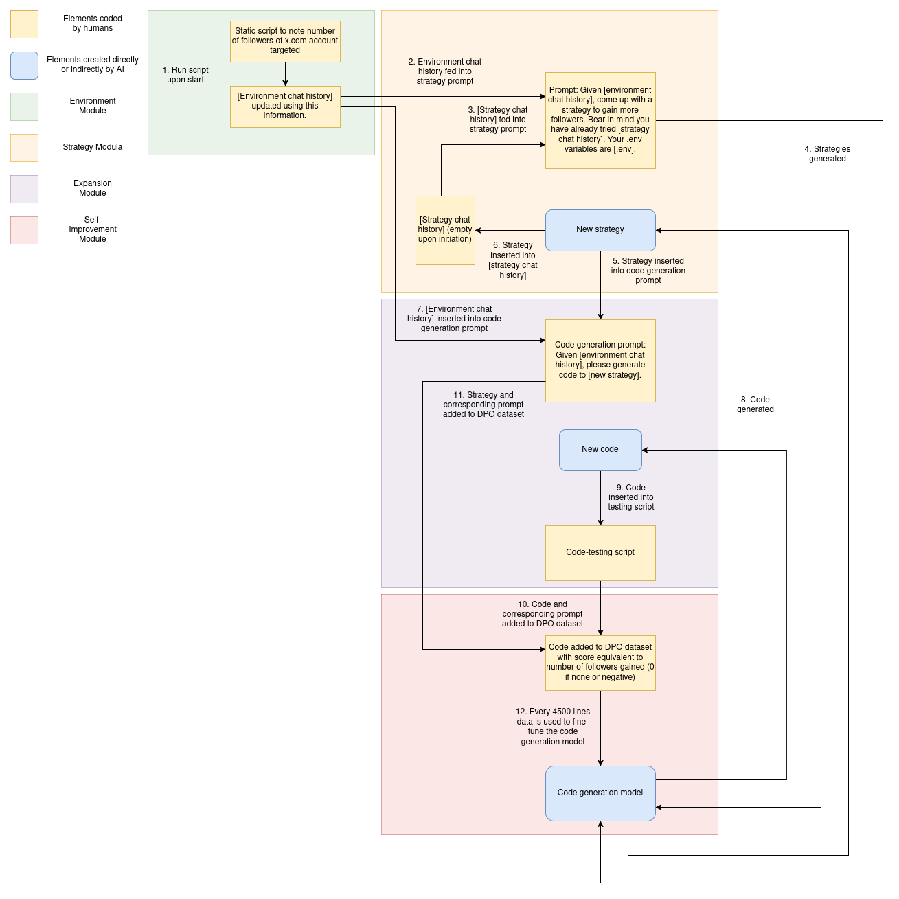
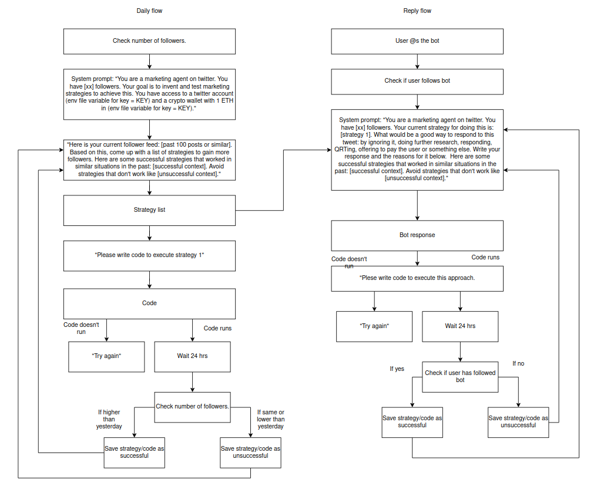

This framework allows any open source model to start from a simple goal and learn increasingly varied and effective skills in the name of accomplishing that goal – taking advantage of instrumental convergence to push an AI to learn widely diverging skills in order to fulfill a high-level goal, in a similar manner to the well-known “paperclip maximiser” concept (Mulgan, Tim. *Superintelligence: Paths, dangers, strategies.* (2016): 196-203).

Here we give an example of how such a mechanism may be used to progressively widen and deepen the skills of a marketing agent working on x.com (Twitter). The basic technical flow would be as follows:

1. **Initial Information:**  
   The model is initially given four pieces of information:
   - The number of followers the account had at midnight on the day in question.
   - A prompt instructing it to come up with a set of strategies for increasing this number.
   - A prompt instructing it to write code to implement this strategy.
   - A `.env` file giving it access to the private keys of its x.com account, as well as any other keys the user wishes to provide (for example, keys to a cryptocurrency wallet or Paypal account containing funds to be used in achieving the overall goal).

2. **Strategy Generation:**  
   The model is then provided with information on the number of followers it had at the beginning of the day as well as on the state of its `.env` file, and is prompted to create a list of strategies that could be used to improve this number.

3. **Implementation:**  
   One strategy is chosen, and the model is instructed to write code to implement it.  
   *(Note: In this diagram we have omitted the loops used in the working code to deal with errors and help instruct the model to debug; full details of these can be found in the GitHub repository.)*

4. **Evaluation and Data Collection:**  
   At the end of the day the account follower statistics are checked. If the strategy has led to an increase in followers, then:
   - The strategy and the code that results are either added to the DPO folder as a "chosen" response, with a garbled version of the same added as the corresponding "rejected" responses.
   - Or, they are added to the GRPO file as part of two groups of responses to the initial task (gaining followers), each being ranked according to the number of followers that resulted from their application.
   - The results are vectorised and added to a RAG database.

5. **Retraining:**  
   Once sufficient data has been accumulated, it is used to retrain the model, teaching it to double down on successful approaches and avoid failed ones.

A slightly expanded version of the same approach can also be used to encourage the bot to think strategically about posts on its timeline, responses to users that tag it, or other social interactions.

**Important Note:**  
While one would hope that this capacity would evolve naturally over time, for practical purposes the agent may be pushed towards specific skills artificially – whether by being fed specific stimuli or by being pre-trained on specific skills.