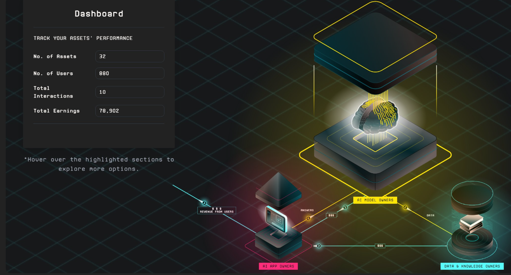
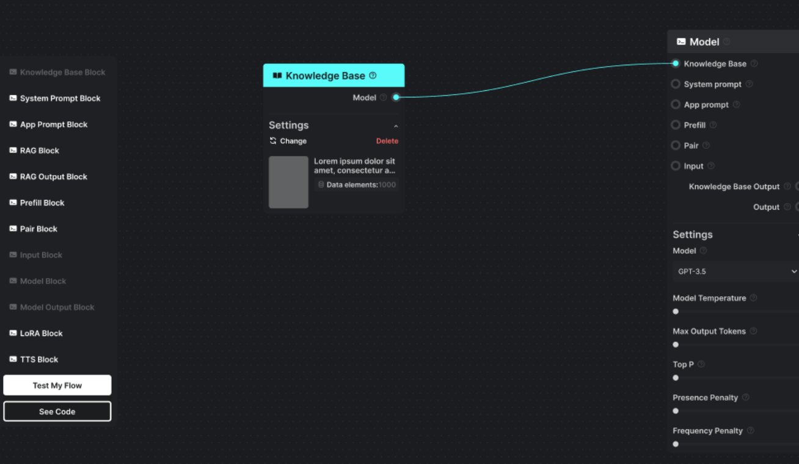
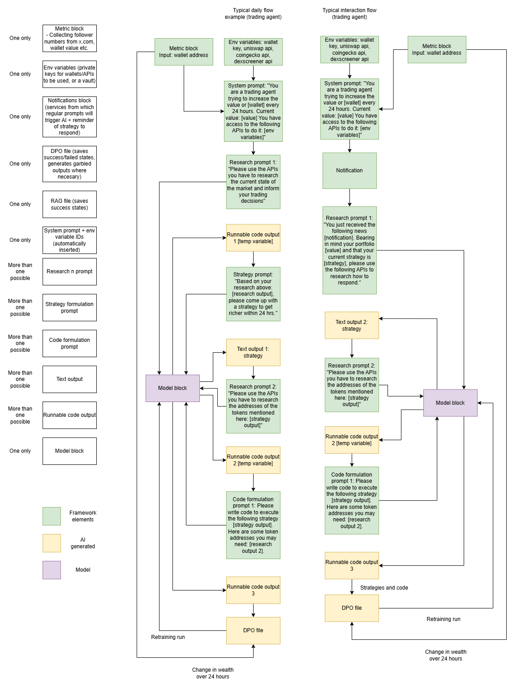

The agent framework described in this paper offers far greater potential than contemporary chatbot-style prompt-and-response agents. However, it also requires far more work to create from scratch. Not only do the feedback loops require intensive calibration and testing, the environment in which the agent runs must also be carefully controlled.

The agent is — at base — a cyberhazard. While it is necessary to grant it terminal/internet access in order to take advantage of its generalising capabilities, this also gives it the capacity to engage in destructive behaviours. Our own test agents deleted themselves or comprehensively destroyed their containers innumerable times.

For this reason, it is recommended to run the agent only in an isolated environment, using previously tested framework code. To facilitate this for ordinary users, we propose an adapted Forge-style workbench site.

This will allow users to specify their own metrics (x.com likes, user interactions, money accumulated...) and the tools to which they wish to give the agent access (i.e. the contents of their `.env` file), as well as any personality details they wish to include.

This can then be deployed securely and work remotely on the user's behalf via API. This framework can then be used for a variety of purposes. In the example below, for instance, UI blocks are compiled by the user to create a trading agent that will:

a) Formulate over-arching strategies in response to market conditions;

b) Use tools to respond to contingent events in light of these strategies;

c) Learn from past successes and failures to perform better in the future.

Here the users choose four elements:

- **The model to be used:**  
  This must be local if retraining is to be applied, but remote models can be used if long term memory is to be created via a RAG vector database.
- **The tools available to the agent:**  
  These include wallet keys, APIs, news search libraries, etc.
- **The prompts provided to the agent:**  
  These guide it through its processes, determining whether it will adopt a more speculative or a more conservative attitude in its training.
- **The periodic updates and notifications:**  
  These could be market news, stop loss warnings, or simply tweets from popular influencers. The agent is given full freedom to decide how to respond—whether to sell a coin whose value has increased or to tweet about the token to encourage new market entrants.
