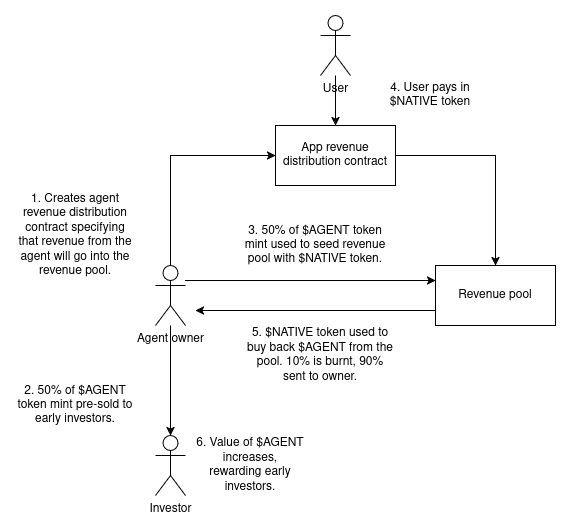

Being a revenue-generating entity, an agent can also constitute a financial asset. We propose the following crowd-funding/investment mechanism to enable creators to fund agent development.

1. **Revenue Distribution Contract:**  
   The Agent Owner creates a revenue distribution contract specifying that **$NATIVE token** revenue from the agent will be used to buy **$AGENT tokens** from the agent's Revenue Pool—a Uniswap v2 style liquidity pool.

2. **Token Minting:**  
   The **$AGENT token** is minted, with 50% being made available for sale to early investors. The remaining 50% of the **$AGENT tokens** are used to seed the Revenue Pool. The amount of **$NATIVE tokens** paid in along with these **$AGENT tokens** determines their launch price.

3. **User Interaction & Revenue Generation:**  
   Users interact with the agent, paying in **$NATIVE tokens**. This interaction may come in multiple forms – for example:
   - Paying to copy-trade a Trading Agent,
   - Using a clone of a successful Engagement Agent to manage their social media accounts,
   - Interacting with a Companion Agent, etc.

4. **Token Buyback Mechanism:**  
   The payments made in **$NATIVE tokens** are used to buy **$AGENT tokens** from the Revenue Pool. Of the total amount purchased:
   - **10%** is burnt,
   - **90%** is returned to the original Agent Owner.

5. **Value Appreciation:**  
   This mechanism helps increase the value of the **$AGENT tokens** held by early investors and the Agent Owner. The tokens can then be exchanged via the Revenue Pool or on the open market.